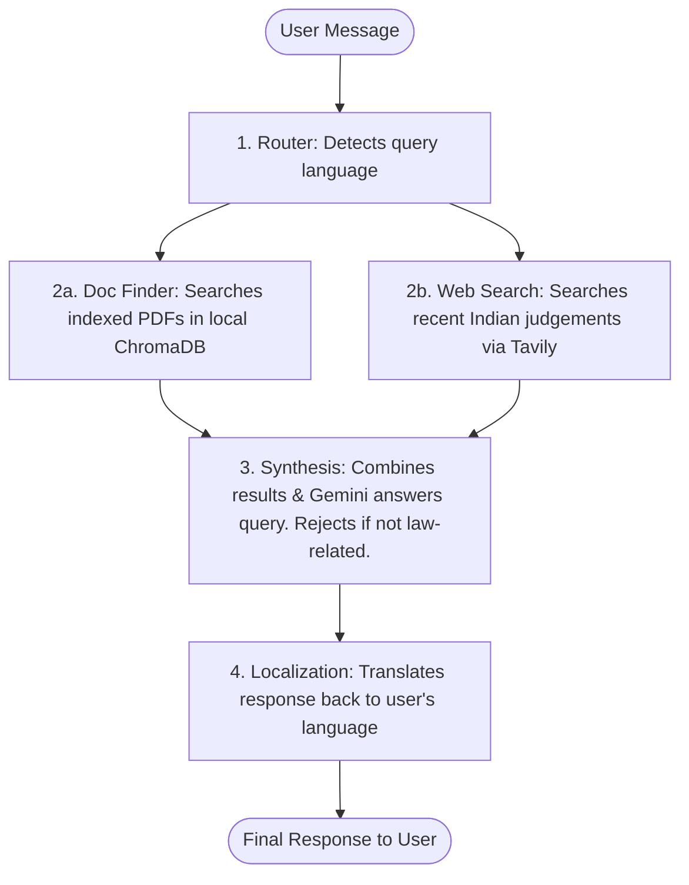

# ⚖️ LegalOpsAI

**An AI-powered chat assistant for Indian legal queries** — search statutory PDFs, pull recent Supreme Court judgments, and get answers in your own language.

🔗 **Live Demo:** [legal-ops-ai-gules.vercel.app](https://legal-ops-ai-gules.vercel.app/)


---

## 📖 Table of Contents

- [What It Does](#-what-it-does-core-features)
- [Tech Stack](#-technical-stack)
- [How It Works](#-how-it-works-under-the-hood)
- [Folder Structure](#-folder-structure)
- [Getting Started](#-getting-started)
- [Testing](#-testing-smtp--authentication)

---

## 🚀 What It Does (Core Features)

| Feature | Description |
|---|---|
| 🔍 **Smart Legal Search (RAG)** | Semantically searches legal PDFs (Constitution, IPC, BNS, etc.) stored in the backend. |
| 🌐 **Web Judgment Lookup** | Uses Tavily to find relevant Indian Supreme Court precedents in real time. |
| 🛡️ **Indian Law Guardrails** | Politely declines questions unrelated to Indian law (e.g. sports, pop culture). |
| 🗣️ **Multi-language Support** | Auto-detects your query language and replies in it — Hindi, Tamil, Telugu, Kannada, Malayalam, or English. |
| 📧 **Email OTP Login** | Simple, passwordless sign-in via emailed verification codes. |
| 💾 **Persistent Chats** | Conversations are saved to MongoDB so you can pick up where you left off. |
| 🌗 **Theme Switcher** | Clean dark and light modes. |

---

## 🛠 Technical Stack

### Backend
| Tool | Purpose |
|---|---|
| **FastAPI** | Serves the backend API |
| **LangGraph & LangChain** | Orchestrates the AI workflow (language detection → search → answer → translation) |
| **ChromaDB** | Local vector database for indexing and searching legal PDFs |
| **SentenceTransformers** (`all-MiniLM-L6-v2`) | Generates embeddings for local documents |
| **Motor & Pymongo** | Async MongoDB connectivity |
| **Google Gemini API** | Powers reasoning and translation |
| **Tavily API** | Live web search for legal precedents |

### Frontend
| Tool | Purpose |
|---|---|
| **React 19 & Vite** | Fast frontend build system |
| **Tailwind CSS v4** | Styling |
| **Lucide Icons** | Icons for nav bar and buttons |
| **React Router Dom** | Navigation between landing, login, and chat pages |

---

## 🧠 How It Works Under the Hood

Every message runs through a **LangGraph workflow**:



1. **Router** — Detects the language of the incoming query.
2. **Document Finder & Web Search** *(run in parallel)*
   - *Document Finder* retrieves relevant sections from PDFs in `backend/data/`.
   - *Web Search* looks up Supreme Court precedents via Tavily.
3. **Synthesis** — Gemini combines local + web context to answer. If the query isn't law-related, a guardrail refuses to answer.
4. **Localization** — Translates the final answer back into the user's original language, if needed.

---

## 📁 Folder Structure

```text
├── backend/
│   ├── agents/            # AI logic, LangGraph flow, search, and translation
│   ├── auth/              # Email OTP verification, JWT login, and security
│   ├── chat/              # Database models and routers to handle chats/conversations
│   ├── data/              # Put your legal PDFs here to index them (IPC, BNS, Constitution)
│   ├── database/          # MongoDB connection code
│   ├── scripts/           # Simple test scripts for email and authentication
│   ├── main.py            # FastAPI main application file
│   └── requirements.txt   # Backend dependencies
├── frontend/
│   ├── src/
│   │   ├── api/           # API fetch wrappers to talk to the backend
│   │   ├── components/    # Reusable UI parts (ChatWindow, Sidebar, etc.)
│   │   ├── context/       # Global contexts (Auth, Theme)
│   │   ├── pages/         # Full pages (Landing, Login, Signup, ChatApp)
│   │   ├── App.jsx        # Main application router
│   │   └── index.css      # Core styles and custom Tailwind setups
│   └── package.json       # Frontend dependencies
└── docker-compose.yml     # Sets up local MongoDB
```

---

## 🏁 Getting Started

### Prerequisites
Make sure you have these installed:
- [Python 3.10+](https://www.python.org/downloads/)
- [Node.js](https://nodejs.org/)
- [Docker](https://www.docker.com/products/docker-desktop/) (to run MongoDB locally)

---

### Step 1 — Start MongoDB

From the project root:

```bash
docker compose up -d
```

This starts a MongoDB container on port `27017`, with data persisted in a local volume.

---

### Step 2 — Set Up the Backend

```bash
cd backend
```

Create your `.env` file from the example:

```bash
# macOS/Linux
cp .env.example .env

# Windows (PowerShell)
cp .env.example .env
```

Fill in the following keys inside `.env`:

| Key | Description |
|---|---|
| `GOOGLE_API_KEY` | Your Gemini API key from Google AI Studio |
| `TAVILY_API_KEY` | Your search API key from Tavily |
| `MAIL_USERNAME` / `MAIL_PASSWORD` | SMTP credentials (e.g. a Gmail App Password) for sending OTP emails |

Create and activate a virtual environment:

```bash
python -m venv venv

# macOS/Linux
source venv/bin/activate

# Windows (PowerShell)
.\venv\Scripts\Activate.ps1
```

Install dependencies:

```bash
pip install -r requirements.txt
```

**Initialize the vector database** — run once before starting the server. This reads the PDFs in `backend/data/` and indexes them into `chroma_db_or_index/`:

```bash
python main.py
```

Start the API server:

```bash
uvicorn main:app --reload
```

> The API will run at `http://localhost:8000`

---

### Step 3 — Set Up the Frontend

```bash
cd frontend
npm install
npm run dev
```

Then open **http://localhost:5173** in your browser.

---

## 🧪 Testing SMTP & Authentication

Two helper scripts live in `backend/scripts/` (run from `backend/` with the venv active):

```bash
# Test SMTP email sending
python scripts/test_email_config.py

# Smoke-test auth + chat endpoints
python scripts/test_auth.py
```

---

## 🤝 Contributing

Issues and pull requests are welcome! If you spot a bug or have a feature idea, feel free to open an issue.

## 📄 License

This project is licensed under the MIT License — see the `LICENSE` file for details.
